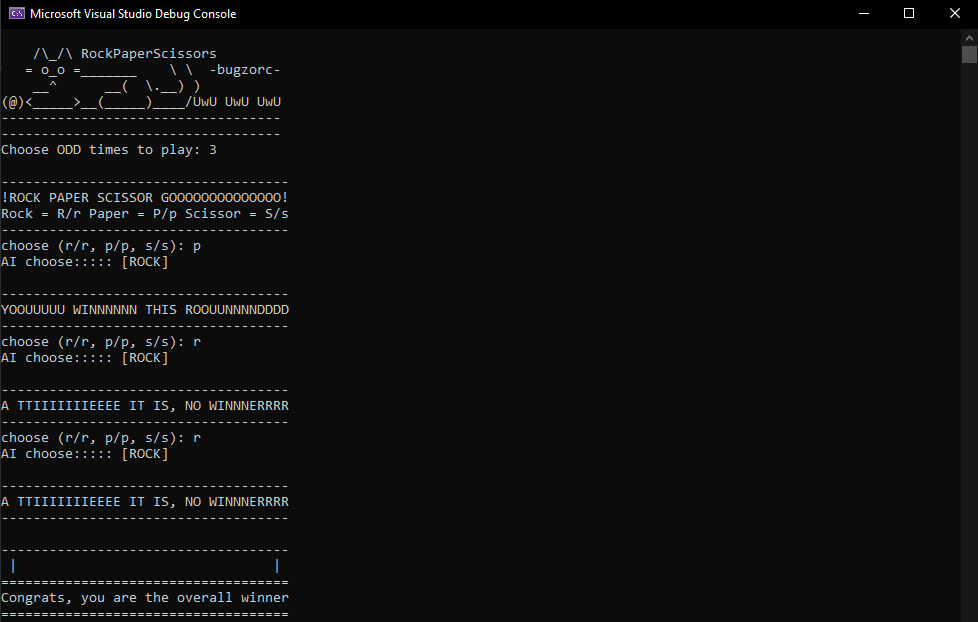

# Rock Paper Scissors 
> CLI based game |=| User VS Randomized Choices |=| No ties only ONE WINNNER
> 
>> **Objective:** To continuously enhance the flexibility and adaptability of the code, ensuring it evolves with my ongoing learning and development of new programming techniques.
***

***
## ☑️Task List for version V1.0.4
- [ ] remove std::endl replace it with \n
>> reason: why you shouldn't use std::endl
- [ ] convert  userChoice to upperCase 
>> in order to simplify the if condition by reducing redundancy
- [ ] use *<random>* utilities rather than *rand()*
- [ ] code diveded into more functions to organize it better and make it readable
